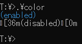
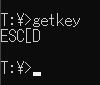

windows1x-virtualterminal-rs
============================

This package provides these features.

- Enable ANSI Escape sequence on Windows1x
- Read one key from the terminal without waiting for the Enter key pressed

Enable ANSI Escape sequence on Windows1x
----------------------------------------

`enable_stdout` and `enable_stderr` set the bit for `ENABLE_VIRTUAL_TERMINAL_PROCESSING` of the console mode.

[examples/color.rs](examples/color.rs)

```rust examples/color.rs
fn main() {
    if let Ok(_) = virtualterminal::enable_stdout() {
        println!("\x1B[36m(enabled)\x1B[0m");
    }
    // When the return value of enable_stdout is dropped,
    // virtual terminal processing is disabled.
    println!("\x1B[36m(disabled)\x1B[0m");
}
```



Read one key from the terminal without waiting for the Enter key pressed
------------------------------------------------

[examples/getkey.rs](examples/getkey.rs)

```rust examples/getkey.rs
fn main() {
    if let Ok(_) = virtualterminal::enable_stdin() {
        if let Ok(_) = virtualterminal::make_raw() {
            if let Ok(key) = virtualterminal::getkey() {
                println!("{}", key.replace("\x1B", "ESC"));
            }
        }
        // When the return value of make_raw() is droppped,
        // the mode is changed to cooked mode.
    }
    // When the return value of enable_stdin() is droppped,
    // virtual_terminal_input is disabled.
}
```

- `virtualterminal::enable_stdin()` enables the virtual terminal input mode of Windows1x.
- `virtualterminal::make_raw()` makes the terminal raw-mode.



This code does NOT work as expected
-----------------------------------

[examples/ng.rs](examples/ng.rs)

```rust examples/ng.rs
fn main() {
    let _ = virtualterminal::enable_stdout().unwrap();
    println!("\x1B[36m(enabled)\x1B[0m");
}
```

The printed text is not colored because the old state is restored by drop before println! is executed.
